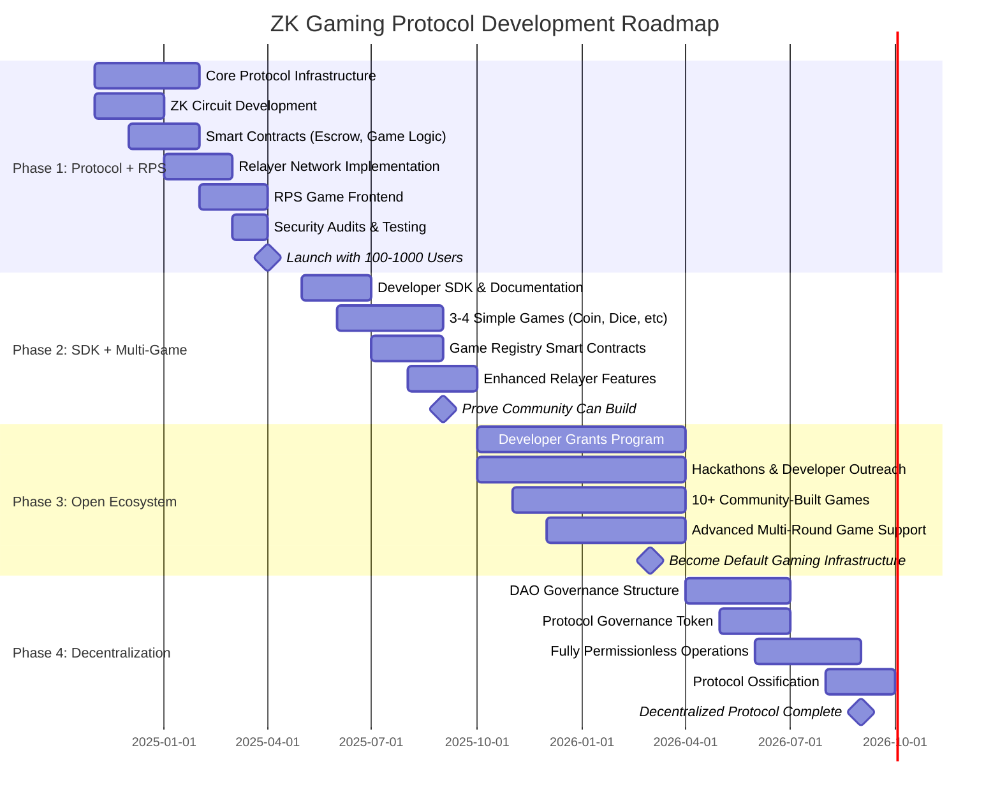

# Protocol Phases Roadmap

## Phase Breakdown

### Phase 1: Protocol + RPS (Months 1-6)
**Goal:** Prove the technology works with a single game

**Key Deliverables:**
- ✅ Core protocol infrastructure
- ✅ ZK proof system for move validation
- ✅ Public relayer network
- ✅ Smart contracts (verification, escrow, settlement)
- ✅ Rock-Paper-Scissors as proof of concept
- ✅ 100-1,000 active users

**Success Criteria:** Players can play RPS with 1-click UX, $0 gas, trustlessly

---

### Phase 2: SDK + Multi-Game (Months 7-12)
**Goal:** Expand beyond RPS, enable other developers to build

**Key Deliverables:**
- ✅ Developer SDK and comprehensive docs
- ✅ 3-4 additional simple games (Coin Flip, Dice Roll, Higher/Lower)
- ✅ Game registry for permissionless deployment
- ✅ Reusable ZK circuit library
- ✅ First external developer builds a game

**Success Criteria:** Prove that others can successfully build games on the protocol

---

### Phase 3: Open Ecosystem (Year 2)
**Goal:** Build network effects, become the default gaming infrastructure

**Key Deliverables:**
- ✅ Developer grants and incentive programs
- ✅ Multiple hackathons focused on game development
- ✅ 10+ games built by community developers
- ✅ Support for complex multi-round games (Blackjack, Poker)
- ✅ Growing ecosystem of games and players

**Success Criteria:** Protocol becomes go-to infrastructure for two-player gaming

---

### Phase 4: Decentralization (Year 3+)
**Goal:** Full decentralization and protocol ossification

**Key Deliverables:**
- ✅ DAO governance structure
- ✅ Governance token for protocol decisions
- ✅ Fully permissionless relayer network
- ✅ Protocol upgrades controlled by community
- ✅ Sustainable, decentralized ecosystem

**Success Criteria:** Protocol operates independently, community-governed, censorship-resistant

---

## Current Status
**We are here:** Starting Phase 1 during ARG25 (3-week accelerator program)

**ARG25 Focus:** Lay foundation for Phase 1 by building core infrastructure and initial RPS proof of concept
