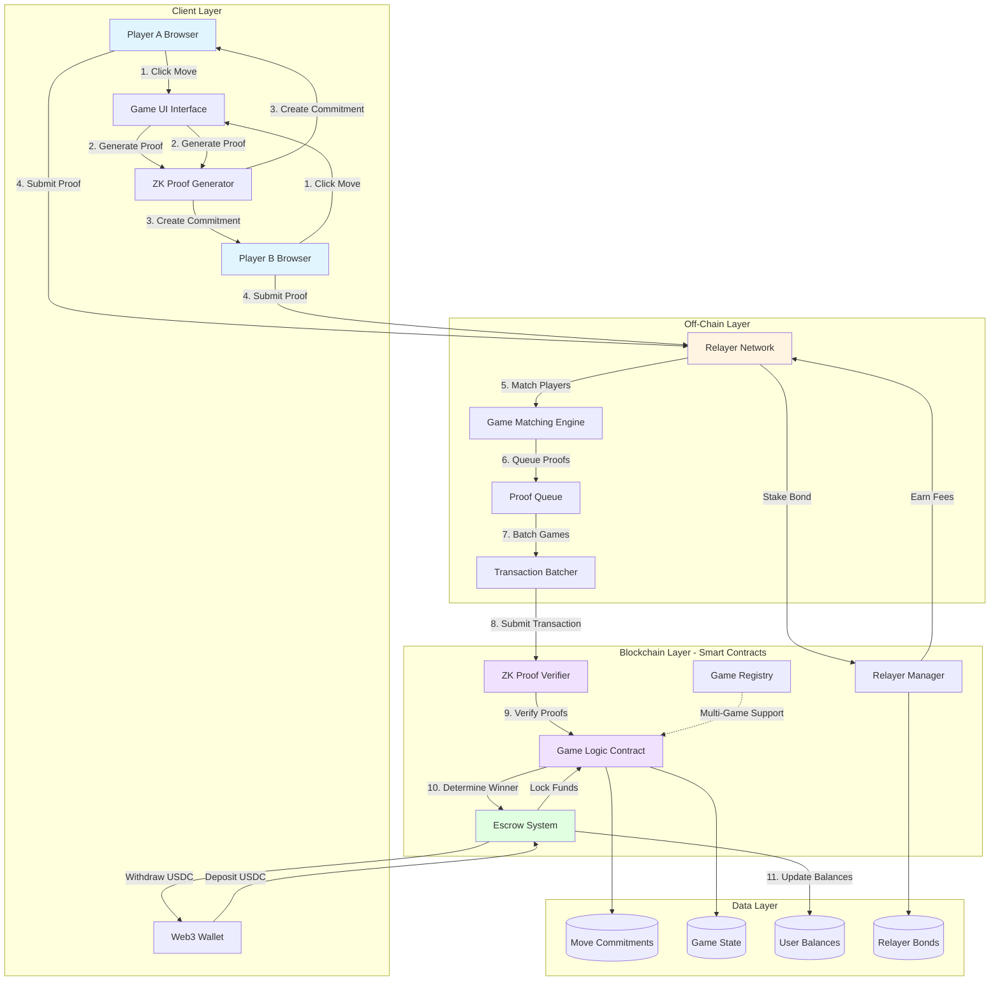
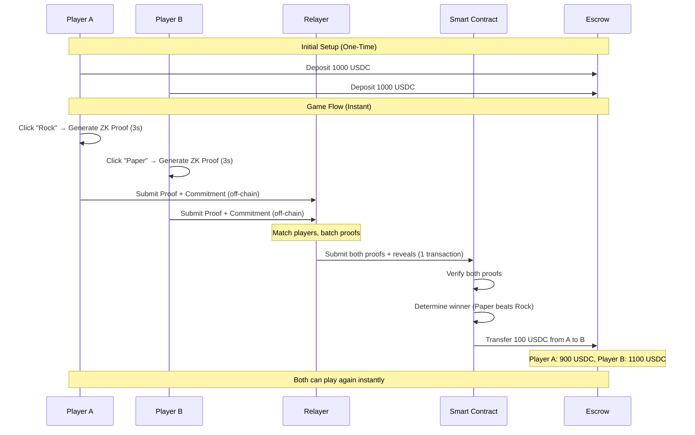

# ZK Gaming Protocol - System Architecture



## Architecture Components

### 1. Client Layer (Browser)

**Game UI Interface**
- One-click gameplay experience
- Real-time game matching display
- Balance and history management

**ZK Proof Generator**
- Runs in browser (no backend required)
- Generates proof in ~3 seconds
- Proof size: ~200 bytes
- Proves: "I chose a valid move (rock/paper/scissors)"

**Web3 Wallet Integration**
- MetaMask, WalletConnect, etc.
- Sign transactions for escrow deposits/withdrawals
- No signature needed per game (relayer handles)

---

### 2. Off-Chain Layer (Relayer Network)

**Relayer Network**
- Permissionless (anyone can run a relayer)
- Economically secured (stake bonds)
- Multiple relayers compete on speed/reliability
- Open-source implementation

**Game Matching Engine**
- Matches Player A + Player B
- Ensures both players have submitted proofs
- Queue management for fair matching

**Proof Queue & Batching**
- Collects ZK proofs from multiple games
- Batches multiple games into single transaction
- Optimizes gas costs (1 tx for N games)

**Economic Model**
- Relayers stake $100 bond
- Earn $1 per game submitted
- Lose bond if they refuse to submit (5-min timeout)
- Rational behavior = always cooperate

---

### 3. Blockchain Layer (Smart Contracts)

**ZK Proof Verifier**
- Verifies cryptographic proofs on-chain
- Ensures proofs are valid and unforged
- Cryptographically bound to player addresses
- Gas-optimized verification

**Game Logic Contract**
- Determines game winner
- Validates move commitments
- Enforces game rules (rock beats scissors, etc.)
- Emits game result events

**Escrow System**
- Deposit once, play forever model
- Locks funds per game
- Automatic payout to winners
- Instant withdrawals (no waiting period)
- Credit balance tracking

**Game Registry** *(Phase 2)*
- Permissionless game deployment
- Registry of all available games
- Standard interface for games
- Fee collection (1.5% protocol fee)

**Relayer Manager**
- Tracks relayer bonds
- Enforces timeout rules
- Distributes fees to relayers
- Slashes bonds for misbehavior

---

### 4. Data Layer

**Move Commitments**
- Cryptographic commitments to moves
- Hidden until simultaneous reveal
- Immutable once submitted

**Game State**
- Active games tracking
- Match history
- Player statistics

**User Balances**
- Escrow credit balances
- Win/loss tracking
- Transaction history

**Relayer Bonds**
- Staked amounts per relayer
- Performance metrics
- Fee earnings

---

## Key Architectural Decisions

### Why Off-Chain Relayers?

**Without Relayers (Traditional):**
```
Player A: Tx1 (commit) → Wait 12s → Tx2 (reveal) → Wait 12s
Player B: Tx1 (commit) → Wait 12s → Tx2 (reveal) → Wait 12s
Result: 4 transactions, 60+ seconds, $20+ gas
```

**With Relayers (Our Architecture):**
```
Player A: Click → ZK proof → Send to relayer
Player B: Click → ZK proof → Send to relayer
Relayer: Batch both → 1 on-chain transaction
Result: 1 click per player, 30-40 seconds, $0 gas for users
```

### Security Without Trust

**Players Cannot:**
- ❌ See opponent's move before committing (ZK commitments hide moves)
- ❌ Change move after seeing opponent (commitments are immutable)
- ❌ Cheat the system (all proofs verified on-chain)

**Relayers Cannot:**
- ❌ Forge proofs (cryptographically bound to addresses)
- ❌ Change moves (commitments verified on-chain)
- ❌ Steal funds (smart contract controls escrow)
- ❌ Refuse submission without penalty (bond slashed)

**Smart Contracts Guarantee:**
- ✅ Both moves revealed simultaneously
- ✅ Winner determined fairly
- ✅ Payouts automatic and trustless
- ✅ All game logic verifiable on-chain

### Scalability

**Batching Benefits:**
- 10 games in 1 transaction = 10x cost reduction
- 100 games in 1 transaction = 100x cost reduction
- Relayers incentivized to batch (higher profit margin)

**Gas Optimization:**
- ZK proofs are small (~200 bytes)
- Verification is gas-efficient
- Batch verification further reduces costs
- Users pay $0 gas (relayer covers, reimbursed from fees)

---

## Data Flow Example: Rock-Paper-Scissors Game



---

## Future Architecture Extensions (Phases 2-4)

### Multi-Game Support
- Game Registry for permissionless deployment
- Shared relayer network across all games
- Universal escrow (one balance, all games)
- Reusable ZK circuits library

### Multi-Round Games
- State channels for complex games (Blackjack, Poker)
- Round-by-round state updates
- Timeout enforcement per round
- Dispute resolution mechanism

### Decentralization
- DAO governance for protocol upgrades
- Community-controlled fee structure
- Permissionless game registry
- Protocol ossification

---

## Current Status

**ARG25 Phase:** Building Phase 1 architecture
- ✅ Core smart contracts (Verifier, GameLogic, Escrow)
- ✅ Basic relayer implementation
- ✅ RPS game as proof of concept
- ✅ Browser-based ZK proof generation

**Not Yet Built:**
- ⏳ Game Registry (Phase 2)
- ⏳ Developer SDK (Phase 2)
- ⏳ Multi-round game support (Phase 3)
- ⏳ DAO governance (Phase 4)
